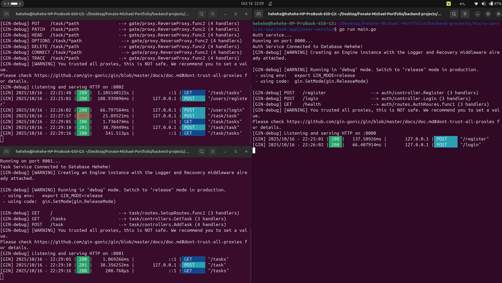

# Microservices Task Management Application

A simple microservices architecture application built with Go that provides user authentication and task management functionality. The application consists of three services: an API Gateway, User Service, and Task Service, all connected to a PostgreSQL database.

## 🏗️ Architecture

This application follows a microservices architecture pattern:



```
┌─────────────────┐    ┌──────────────────┐
│   API Gateway   │    │   PostgreSQL     │
│   (Port 8002)   │◄──►│   Database       │
└─────────────────┘    └──────────────────┘
         │
    ┌────▼────┐
    │         │
┌───▼────────┐ ┌────────▼──┐
│User Service│ │Task Service│
│(Port 8000) │ │(Port 8001) │
└────────────┘ └────────────┘
```

### Services Overview

- **API Gateway** (`:8002`): Acts as a reverse proxy and routing layer
- **User Service** (`:8000`): Handles user authentication (register/login)
- **Task Service** (`:8001`): Manages task CRUD operations
- **PostgreSQL Database**: Shared database for both services

## 📋 Database Schema

```sql
CREATE TABLE users(
    id SERIAL PRIMARY KEY,
    username VARCHAR(200) NOT NULL,
    email VARCHAR(200) NOT NULL UNIQUE,
    password TEXT NOT NULL
);

CREATE TABLE tasks(
    id SERIAL PRIMARY KEY,
    user_id INTEGER REFERENCES users(id),
    title VARCHAR(200) NOT NULL,
    description TEXT
);
```

## 🚀 Quick Start

### Prerequisites

- Go 1.25.3 or higher
- PostgreSQL database
- Git

### Installation

1. **Clone the repository**
   ```bash
   git clone https://github.com/Fonate-Michael/Microservices-Task-Management-Application.git
   cd Microservices-Task-Management-Application
   ```

2. **Set up environment variables**

   Create `.env` files in each service directory with the following variables:

   **API Gateway** (`api-gate-way/.env`):
   ```env
   # No environment variables needed for API Gateway
   ```

   **User Service** (`user-service/.env`):
   ```env
   DB_USER=your_db_user
   DB_PASS=your_db_password
   DB_NAME=your_db_name
   DB_SSL=disable
   ```

   **Task Service** (`task-service/.env`):
   ```env
   DB_USER=your_db_user
   DB_PASS=your_db_password
   DB_NAME=your_db_name
   DB_SSL=disable
   ```

3. **Install dependencies**
   ```bash
   # API Gateway
   cd api-gate-way
   go mod download

   # User Service
   cd ../user-service
   go mod download

   # Task Service
   cd ../task-service
   go mod download
   ```

4. **Set up the database**

   Create a PostgreSQL database and run the schema:
   ```sql
   CREATE TABLE users(
       id SERIAL PRIMARY KEY,
       username VARCHAR(200) NOT NULL,
       email VARCHAR(200) NOT NULL UNIQUE,
       password TEXT NOT NULL
   );

   CREATE TABLE tasks(
       id SERIAL PRIMARY KEY,
       user_id INTEGER REFERENCES users(id),
       title VARCHAR(200) NOT NULL,
       description TEXT
   );
   ```

5. **Start the services**

   Open three terminal windows and start each service:

   ```bash
   # Terminal 1 - API Gateway
   cd api-gate-way
   go run main.go

   # Terminal 2 - User Service
   cd ../user-service
   go run main.go

   # Terminal 3 - Task Service
   cd ../task-service
   go run main.go
   ```

   The services will start on:
   - API Gateway: `http://localhost:8002`
   - User Service: `http://localhost:8000`
   - Task Service: `http://localhost:8001`

## 📚 API Documentation

### API Gateway Endpoints

The API Gateway acts as a reverse proxy and forwards requests to the appropriate services:

- **User Service Routes** (prefixed with `/users/`):
  - `POST /users/register` - User registration
  - `POST /users/login` - User login
  - `GET /users/health` - Health check

- **Task Service Routes** (prefixed with `/task/`):
  - `GET /task/tasks` - Get all tasks (public endpoint)
  - `POST /task/task` - Create a new task (protected)

### Authentication

The application uses JWT (JSON Web Tokens) for authentication:

1. **Register/Login** to get a JWT token
2. **Include the token** in the `Authorization` header for protected routes:
   ```
   Authorization: Bearer <your-jwt-token>
   ```

### API Endpoints

#### User Service

##### Register User
```http
POST http://localhost:8002/users/register
Content-Type: application/json

{
  "username": "johndoe",
  "email": "john@example.com",
  "password": "securepassword"
}
```

**Response:**
```json
{
  "message": "User registered successfully"
}
```

##### Login User
```http
POST http://localhost:8002/users/login
Content-Type: application/json

{
  "email": "john@example.com",
  "password": "securepassword"
}
```

**Response:**
```json
{
  "token": "eyJhbGciOiJIUzI1NiIsInR5cCI6IkpXVCJ9..."
}
```

##### Health Check
```http
GET http://localhost:8002/users/health
```

**Response:**
```json
{
  "message": "Bitch am alive!"
}
```

#### Task Service

##### Get All Tasks (Public)
```http
GET http://localhost:8002/task/tasks
```

**Response:**
```json
{
  "tasks": [
    {
      "id": 1,
      "user_id": 1,
      "title": "Complete project",
      "description": "Finish the microservices application"
    }
  ]
}
```

##### Create Task (Protected)
```http
POST http://localhost:8002/task/task
Authorization: Bearer <your-jwt-token>
Content-Type: application/json

{
  "title": "New Task",
  "description": "Task description"
}
```

**Response:**
```json
{
  "message": "Tasks Created successfully!"
}
```

## 🛠️ Development

### Project Structure

```
micro-services-app(task-app)/
├── api-gate-way/           # API Gateway service
│   ├── main.go            # Main application entry
│   ├── proxy/
│   │   └── proxy.go       # Reverse proxy implementation
│   ├── go.mod
│   └── .env
├── user-service/          # Authentication service
│   ├── main.go           # Main application entry
│   ├── controller/
│   │   └── auth_controller.go  # Auth endpoints
│   ├── db/
│   │   └── db.go         # Database connection
│   ├── model/
│   │   └── user.go       # User model
│   ├── routes/
│   │   └── route.go      # Route definitions
│   ├── go.mod
│   └── .env
└── task-service/          # Task management service
    ├── main.go           # Main application entry
    ├── controllers/
    │   └── task_controller.go  # Task endpoints
    ├── db/
    │   └── db.go         # Database connection
    ├── middleware/
    │   └── auth_middleware.go  # JWT authentication
    ├── model/
    │   └── model.go      # Task model
    ├── routes/
    │   └── route.go      # Route definitions
    ├── go.mod
    └── .env
```

### Key Technologies

- **Go (Golang)**: Main programming language
- **Gin Framework**: HTTP web framework
- **PostgreSQL**: Database
- **JWT**: Authentication tokens
- **bcrypt**: Password hashing

### Security Features

- Password hashing using bcrypt
- JWT-based authentication
- Protected routes middleware
- CORS enabled for cross-origin requests

## 🔧 Configuration

### Database Configuration

Both services connect to the same PostgreSQL database using environment variables:
- `DB_USER`: Database username
- `DB_PASS`: Database password
- `DB_NAME`: Database name
- `DB_SSL`: SSL mode (typically "disable" for development)

### JWT Configuration

JWT tokens are signed with a secret key (`"secret_key"`) and expire after 2 hours.

## 🚨 Troubleshooting

### Common Issues

1. **Database Connection Errors**
   - Ensure PostgreSQL is running
   - Check database credentials in `.env` files
   - Verify database and tables exist

2. **Service Communication Issues**
   - Ensure all three services are running
   - Check that ports 8000, 8001, and 8002 are available
   - Verify service URLs in API Gateway configuration

3. **Authentication Errors**
   - Ensure JWT token is included in Authorization header
   - Check token expiration (2 hours)
   - Verify user exists in database

## 📝 License

This project is open source and available under the [MIT License](LICENSE).

## 🤝 Contributing

1. Fork the repository
2. Create a feature branch (`git checkout -b feature/amazing-feature`)
3. Commit your changes (`git commit -m 'Add some amazing feature'`)
4. Push to the branch (`git push origin feature/amazing-feature`)
5. Open a Pull Request


